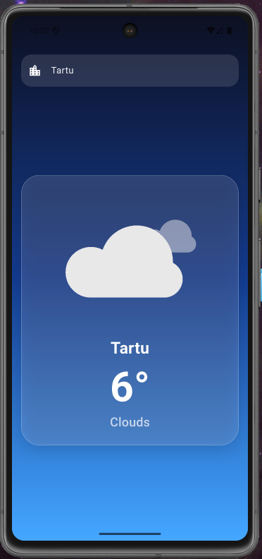

# Weather Mapp

Simple Flutter weather app with:
- current weather by current location
- city search with autocomplete dropdown
- animated weather states via Lottie
- loading and empty/error states

<p align="center">
  
</p>

## Table of Contents
- [About The Project](#about-the-project)
- [Built With](#built-with)
- [Getting Started](#getting-started)
- [Prerequisites](#prerequisites)
- [Installation](#installation)
- [IDE and Devices](#ide-and-devices)
- [Usage](#usage)
- [Contact](#contact)
- [Acknowledgments](#acknowledgments)

## About The Project

`weather_mapp` is a Flutter mobile app that fetches weather data from OpenWeather
and supports city suggestions through geocoding.

Main flow:
1. App starts and asks for location permission.
2. Current city is resolved from GPS coordinates.
3. Weather is loaded and shown with animation.
4. User can type a city and pick it from suggestions.

## Built With

- [Flutter](https://flutter.dev/)
- [Dart](https://dart.dev/)
- [OpenWeather API](https://openweathermap.org/api)
- [Open-Meteo Geocoding API](https://open-meteo.com/en/docs/geocoding-api)
- [Lottie](https://pub.dev/packages/lottie)
- [Geolocator](https://pub.dev/packages/geolocator)
- [Geocoding](https://pub.dev/packages/geocoding)
- [http](https://pub.dev/packages/http)
- [flutter_dotenv](https://pub.dev/packages/flutter_dotenv)

## Getting Started

To get a local copy up and running, follow these steps.

## Prerequisites

- Flutter SDK (stable channel)
- OpenWeather API key
- For Android: Android SDK + emulator/device support
- For iOS Xcode + iOS Simulator
- VS Code with Flutter and Dart extensions, or Android Studio as IDE

Notes:
- Android Studio is not strictly required as an IDE, but it is the easiest way to install/manage Android SDK and AVD emulators.
- If you run from VS Code, device discovery and launch still come from Flutter tools (`flutter devices`, `flutter run`).

## Installation

1. Clone the repo:
```bash
git clone <your-repo-url>
cd weather_mapp
```

2. Install dependencies:
```bash
flutter pub get
```

3. Create `.env` file in project root:
```env
OPEN_WEATHER_API_KEY=your_openweather_api_key
```

4. Run the app:
```bash
flutter run
```

## IDE and Devices

When VS Code shows the device picker, these entries usually mean:

- `Chrome` -> web target
- `macOS` -> desktop target
- `Start iOS Simulator` -> iOS simulator from Xcode
- `Start Pixel ...` -> Android emulator (AVD) from Android SDK
- `Create Android emulator` -> create a new AVD

`Offline Emulators` means the emulator exists but is not currently running.

## Usage

- Type a city name in the input field.
- Pick a suggestion from dropdown (recommended).
- Or press Enter to search by typed city name.
- If city is invalid, app shows `City not found` with `nodata` animation.

Notes:
- OpenWeather key must be active; a fresh key can take a few minutes.
- On emulator, location may default to Mountain View unless you set mock GPS.


## Contact

Project path: `/Users/kurbram/AndroidStudioProjects/weather_mapp`

## Acknowledgments

- [Best-README-Template](https://github.com/othneildrew/Best-README-Template)
